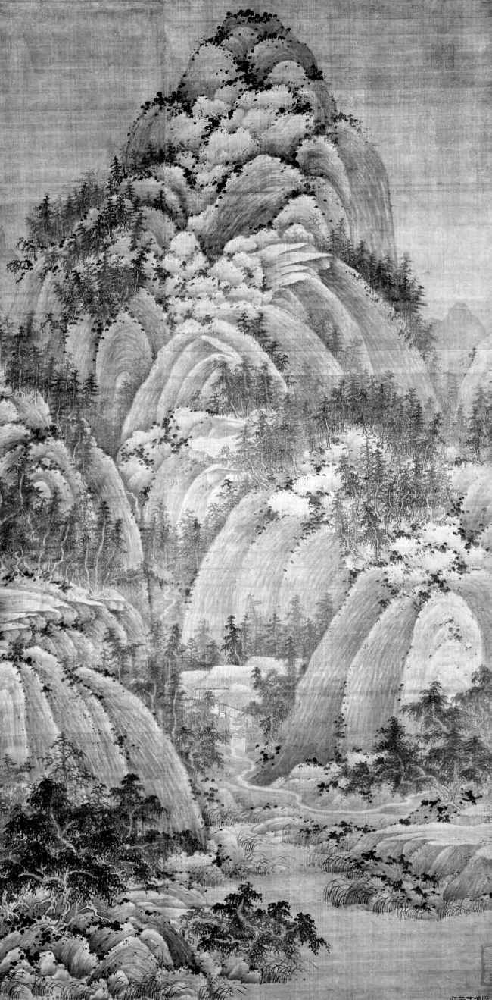

欧阳修

予少以进士游京师[
[\[337\]](#note_337)
] ，因得尽交当世之贤豪。然犹以谓国家臣一四海[
[\[338\]](#note_338)
] ，休兵革[
[\[339\]](#note_339)
]
，养息天下以无事者四十年，而智谋雄伟非常之士，无所用其能者，往往伏而不出，山林屠贩[
[\[340\]](#note_340)
]
，必有老死而世莫见者，欲从而求之不可得。其后得吾亡友石曼卿[
[\[341\]](#note_341)
] 。

#### 注释 

[\[337\]](#noteBack_337)
京师：北宋都城汴京，在今河南开封。

[\[338\]](#noteBack_338)
国家：指当时的朝廷。臣一：臣服，统一。四海：古代以为中国在四海之中，故四海指全国。

[\[339\]](#noteBack_339)
兵革：这里指战争。兵，武器。革，将士作战用的甲胄。

[\[340\]](#noteBack_340)
山林屠贩：指隐居山林做屠夫、商贩的隐士。

[\[341\]](#noteBack_341)
曼卿：名延年，河南商丘人，北宋诗人。他一生遭受冷落，很不得志。

#### 译文 

我年轻时因考进士寄居京城，因而有机会遍交当时的贤者豪杰。不过我还认为：国家臣服统一了四方，停止了战争，休养生息以至天下太平了四十年，那些无处发挥才能的智谋雄伟不寻常之人，就往往蛰伏不出，隐居山林，他们从事屠宰贩运，必定有老死其间而不被世人发现的。我想要跟从访求他们，与之结交而不可得。后来认识了我那亡友石曼卿。

------------------------------------------------------------------------

曼卿为人，廓然有大志[
[\[342\]](#note_342)
]
，时人不能用其材，曼卿亦不屈以求合。无所放其意，则往往从布衣野老[
[\[343\]](#note_343)
] ，酣嬉淋漓，颠倒而不厌。予疑所谓伏而不见者，庶几狎而得之[
[\[344\]](#note_344)
] ，故尝喜从曼卿游，欲因以阴求天下奇士[
[\[345\]](#note_345)
] 。

#### 注释 

[\[342\]](#noteBack_342)
廓然：开朗豪放的样子。

[\[343\]](#noteBack_343)
布衣：百姓。野老：乡村老人。

[\[344\]](#noteBack_344)
庶几：或许。狎：亲近而且态度随便。

[\[345\]](#noteBack_345)
阴求：暗中寻求。

#### 译文 

曼卿的为人，胸怀开阔而有大志，今人不能用他的才能，曼卿也不肯委屈自己迁就别人。没有施展志向的地方，就往往跟布衣村民饮酒嬉戏，闹得痛快癫狂也不满足。因此我怀疑所谓蛰伏而不被发现的人，或许会在接近曼卿时找到。所以我常常跟从曼卿游玩，想借此暗中访求天下奇士。

------------------------------------------------------------------------

浮屠秘演者[
[\[346\]](#note_346)
] ，与曼卿交最久，亦能遗外世俗[
[\[347\]](#note_347)
]
，以气节自高。二人欢然无所间。曼卿隐于酒，秘演隐于浮屠，皆奇男子也。然喜为歌诗以自娱。当其极饮大醉，歌吟笑呼，以适天下之乐，何其壮也！一时贤士皆愿从其游，予亦时至其室。十年之间，秘演北渡河[
[\[348\]](#note_348)
] ，东之济、郓[
[\[349\]](#note_349)
]
，无所合，困而归。曼卿已死，秘演亦老病。嗟夫！二人者，予乃见其盛衰，则予亦将老矣！

#### 注释 

[\[346\]](#noteBack_346)
浮屠：佛教，也称和尚。也作"浮图"。

[\[347\]](#noteBack_347)
遗外：超脱，即抛弃世俗的功名富贵。

[\[348\]](#noteBack_348)
河：黄河。

[\[349\]](#noteBack_349)
济、郓：济州、郓州，都在今山东省。

#### 译文 

和尚秘演和曼卿交往最久，也能够将自己遗弃在世俗之外，以崇尚气节来提升自己的修养。两个人相处融洽毫无嫌隙。曼卿在酒中隐匿，秘演则在佛教中隐匿，所以他们都是奇男子，然而又都喜欢作诗自我娱乐。当他们狂饮大醉之时，又唱又吟，又笑又叫，以共享天下的乐趣，这是多么豪迈啊！当时的贤士，都愿意跟从他们交游，我也常常上他们家。十年间，秘演北渡黄河，东到济州、郓州，没有遇上知己朋友，困顿而归。这时曼卿已经死了，秘演也是又老又病。唉！这两个人，我竟看到了他们从壮年至衰老，那么我自己也将衰老了吧！

------------------------------------------------------------------------

夫曼卿诗辞清绝[
[\[350\]](#note_350)
]
，尤称秘演之作，以为雅健有诗人之意。秘演状貌雄杰，其胸中浩然[
[\[351\]](#note_351)
]
。既习于佛，无所用，独其诗可行于世，而懒不自惜。已老，胠其橐[
[\[352\]](#note_352)
] ，尚得三四百篇，皆可喜者。

#### 注释 

[\[350\]](#noteBack_350)
清绝：清新绝顶，即特别清新。

[\[351\]](#noteBack_351)
浩然：刚直正大之气。

[\[352\]](#noteBack_352)
胠（qū）：打开。橐：袋子。

#### 译文 

曼卿的诗特别清新，可他更称道秘演的作品，以为典雅劲健，有诗人的意趣。秘演相貌雄伟出众，他的胸中又存有浩然正气。然而已经学了佛，也就没有可用之处了，只有他的诗歌能够流传于世，可是他自己又懒散而不爱惜。到了晚年打开他的箱子，还能得到三四百首，都是值得玩味的好作品。

------------------------------------------------------------------------

曼卿死，秘演漠然无所向。闻东南多山水，其巅崖崛峍[
[\[353\]](#note_353)
]
，江涛汹涌，甚可壮也，遂欲往游焉。足以知其老而志在也。于其将行，为叙其诗，因道其盛时以悲其衰。

#### 注释 

[\[353\]](#noteBack_353)
崛峍（lù）：高峻陡峭。

#### 译文 

曼卿死后，秘演寂寞无处可去。听说东南地区多山水美景，那儿高峰悬崖峭拔险峻，长江波涛汹涌，甚是壮观，便想到那儿去游玩。这就足以知晓他人虽老了可是志气尚在。在他临行之时，我为他的诗集写了序言，借此称道他的壮年并为他的衰老而悲哀。

[]

::: kindle-cn-bodycontent-div-alone100

宋·巨然《秋山问道图》
:::

[]

# 卷十　宋文 

